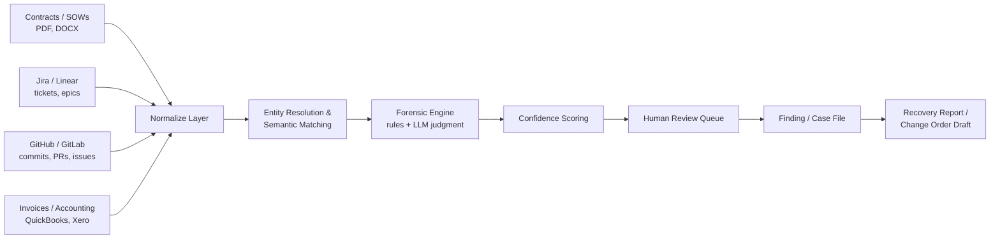

# ShipLedger — Product, Technical & Go-to-Market Plan
*Working name — placeholder, not locked. "Ships" (dev culture for delivered work) + "Ledger" (the financial record). Rebrand freely.*

---

## 0. One-Paragraph Summary

ShipLedger is a delivery-evidence reconciliation tool for software development agencies, IT consultancies, and engineering outsourcing shops. It reads what was actually contracted (SOWs), what was actually built (GitHub/GitLab commits, PRs, and Jira/Linear tickets), and what was actually invoiced — then surfaces the gap as an evidence-backed finding a human can approve and bill. It launches as a manual, no-code audit service (Phase 0), converts audit clients into a monitoring subscription, and only then becomes software. This sequencing is deliberate: it is both the fastest path to revenue and the mechanism that generates the training data and case-file patterns the eventual product needs.

---

## 1. Problem & Why Now

Professional-services firms lose an estimated 5–12% of earned revenue to unbilled work, scope creep, and missed milestones — a figure repeated across vendor marketing (Certinia, Deltek, LeakShield) but never independently verified. Treat it as directional, not proven, until your own audits confirm or deny it for this specific segment.

**Why dev/IT services specifically, not "professional services" broadly:** every existing player in adjacent "revenue leakage" software reconciles *billing and financial systems only* — Stripe records, CRM data, internal time-tracking. None of them read GitHub, GitLab, Jira, or Linear to verify what was *actually engineered*. Software delivery is the one professional-services category that leaves a hard-to-fake, timestamped, third-party-verifiable record of work performed. That data source is the entire differentiation. Outside dev work, it doesn't exist, so the wedge collapses — stay narrow on purpose.

**Why now:** LLM-based document extraction and code-aware retrieval only became reliable enough for messy real-world SOWs and sprawling repo histories in the last 12–18 months. Three years ago this was a research problem. Now it's an engineering problem.

---

## 2. What The Product Does

Core mechanism, in one line: **reconstruct the delivery-to-billing chain from four record types, then surface the gaps as evidence, not opinions.**

| Input | What it proves |
|---|---|
| Contract / SOW | What was sold — scope, quantities, rates, milestones, exclusions |
| Jira / Linear | What was planned and tracked |
| GitHub / GitLab | What was actually built — commits, PRs, merges, deploys |
| Invoices / accounting | What was billed and collected |

The output is never a black-box score. Every finding carries: the contract clause it's measured against, the delivery evidence supporting it, the billing state, an assessment (billable / already covered / ambiguous), and a recommended action a human approves. Precision over volume — a handful of high-confidence findings beats a flood of maybes.

---

## 3. Target Customer (ICP)

**Primary ICP:** Software development agencies, IT consultancies, and engineering outsourcing firms, 10–50 employees.

Why this size band: large enough that a single missed milestone or scope-creep episode is worth ₹3–10L+ (real money, real urgency), small enough that the founder/COO feels the pain personally and can say yes without a procurement committee. Above ~50 people, you're competing with enterprise tools (xfactrs, Banyan AI) and a longer sales cycle; below ~10, contract values are usually too small to justify the audit fee.

**Buyer personas:**
- **Founder/COO (shops <25 people):** feels the P&L pain directly, decides fast, needs the pitch to be "we found money you already earned," not a software demo.
- **Delivery Head / Finance Lead (shops 25–50 people):** owns margin as a KPI, more receptive to the "prevent this going forward" monitoring pitch once the audit proves value.

**Geography for first customers:** you're positioned well for this in-person. Thiruvananthapuram's Technopark alone hosts a large concentration of exactly this company profile within a short radius, and Kerala/India broadly is one of the densest IT-services markets in the world. Local, warm-intro-driven customer #1 through #5 is more efficient here than cold digital outreach — use it before scaling beyond it.

---

## 4. Feature Set, By Build Phase

### Phase 0 — Concierge Audit (no software required)
- Manual intake of SOW, exported Jira/GitHub data, invoices
- Founder-led reconciliation and report writing
- Deliverable: a single PDF/slide finding report per project
- **Goal: prove the premise, not build a product.**

### Phase 1 — Audit MVP
- Document upload (PDF/DOCX/XLSX/CSV) + Jira/Linear export upload
- LLM-assisted contract extraction (structured scope/rate/milestone data)
- Semi-automated reconciliation with human review before any finding is finalized
- Templated report generation (finding anatomy below)
- No live connectors yet — repeatable analysis, not real-time

### Phase 2 — Delivery Graph
- Live connectors: GitHub, GitLab, Jira, Linear (OAuth-based)
- Entity resolution across systems (contract line ↔ ticket ↔ PR/commit)
- Confidence-scored findings, decomposed (not a single opaque number)
- Review-queue UI for approving/dismissing/escalating findings
- Accounting connector (QuickBooks, Xero, or regional equivalent)

### Phase 3 — Continuous Monitoring
- Always-on reconciliation of active projects
- Real-time alerts on scope-creep language, milestone/billing mismatches
- Auto-drafted change-order and invoice-line recommendations (human-approved, never auto-sent)
- Cross-client benchmarking (with privacy controls) once enough audits exist

**Finding anatomy (every phase, non-negotiable):** commercial baseline → delivery evidence → billing state → assessment → supporting/contradicting records → recommended action (approve / dismiss / request review / draft change order).

---

## 5. Competitive Positioning

| Player | What they read | Approach | Why this is different |
|---|---|---|---|
| LeakShield / LeakGuard AI | Stripe billing data | Subscription billing reconciliation | Built for recurring SaaS billing, no code or PM-system awareness |
| xfactrs, Banyan AI | CRM, billing, contract systems | Enterprise lead-to-cash leakage, ₹40L+/yr | Enterprise-only motion, inaccessible to SMB agencies |
| Certinia, BigTime, Deltek (PSA suites) | Internal time-tracking within their own platform | Prevent leakage by replacing your tools with an all-in-one suite | Requires migration; this product integrates, doesn't replace |
| Kantata + Provus | CRM/CPQ → project execution | Improve future quoting accuracy | Forward-looking (quoting), not forensic recovery of completed work |
| **ShipLedger** | GitHub/GitLab + Jira/Linear + SOW + invoices | Forensic delivery-to-billing reconciliation, dev/IT services specific | Only one reading actual engineering delivery evidence, not just billing or time records |

The one-sentence pitch this has to survive: *"Unlike [X], we don't touch your billing stack or ask you to migrate anything — we read the GitHub and Jira you already have, and tell you what it says you're owed."*

---

## 6. Monetization & Payment Wall

### Pricing (INR primary; adjust for other markets later)

| Tier | Price | What's included |
|---|---|---|
| **Free diagnostic** | ₹0 | Headline number + confidence band only (e.g. "High confidence: ~₹4L identified"). No evidence detail. Pure teaser. |
| **Forensic Audit** (one-time) | ₹25,000–₹1,00,000 flat, **or** 10% success fee on verified recovery, client's choice | Full evidence report — every finding, full anatomy, exportable case file |
| **Monitoring** (recurring) | ₹15,000+/month, scales with active project count | Continuous reconciliation, live connectors, real-time alerts |
| **Enterprise** | Custom, annual | SSO, custom policy rules, cross-project benchmarking, dedicated support |

### Payment wall logic — what's actually gated
- **Free tier shows the number, never the evidence.** Enough to create desire, nothing actionable — you cannot bill a client off a headline figure alone, only off the full case file.
- **Audit unlocks the case file** — the artifact that's actually usable in a client conversation.
- **Monitoring unlocks automation** — connectors instead of manual upload, alerts instead of on-demand reports, trend/benchmark data.
- Contingency (10%) vs. flat fee is offered as a **client choice**, not a forced structure — contingency lowers the trust barrier for the first sale (they only pay if you find something), flat fee suits clients uncomfortable sharing revenue-linked terms.

---

## 7. Go-To-Market & Customer Acquisition

**Channels, ranked by expected efficiency at this stage:**

1. **Warm network / local IT-services community** (Technopark and Kerala IT ecosystem) — highest-trust, fastest close for customers #1–5.
2. **Referral loop** — this business has unusually strong referral potential because ROI is immediate and undeniable ("we found ₹X you already earned"). Ask every closed audit for two warm intros.
3. **Anonymized case studies** — published on LinkedIn once you have 2–3 real results. This is the single highest-leverage marketing asset you'll produce; nothing else in this plan sells as well as one credible number.
4. **Community/association engagement** — NASSCOM events, local software-company associations, agency-owner WhatsApp/Slack/Discord groups.
5. **Adjacent-service partnerships** — CAs/accountants and Jira/Linear implementation consultants who serve the same SMB IT-services clients but don't compete with you; referral arrangement.
6. **Targeted cold outreach** (LinkedIn Sales Navigator, filtered to IT-services SMEs 10–50 employees) — only after step 3 exists, so the outreach can reference a real result instead of a cold claim.

**Sequence:**
- Weeks 1–2: 5–10 warm-intro conversations, free diagnostic offered
- Weeks 3–4: convert 2–3 to paid audits, collect real case data
- Month 2: publish first anonymized case study
- Month 2–3: cold outreach referencing the case study, 50–100 similar-profile targets
- Month 3+: begin Phase 1 build using patterns learned manually; start converting audit clients to monitoring

---

## 8. Technical Architecture

### System / data flow



### Tech stack

| Layer | Choice | Why |
|---|---|---|
| Backend API | Python + FastAPI | Strong LLM/data tooling, async, fast to iterate solo |
| Frontend | TypeScript + Next.js (React) | Review-queue UI, dashboard, fast to ship |
| Primary database | PostgreSQL + `pgvector` extension | Relational + vector search in one system — avoids running separate infra as a solo founder |
| Object storage | S3 (or GCS) | Raw uploaded contracts, exports, evidence artifacts |
| LLM (extraction & judgment) | Claude via Anthropic API, tool-use for structured JSON | Strongest available fit for long-document structured extraction and reliable schema-conformant output |
| Embeddings | Dedicated embedding model (e.g. Voyage AI, or open-source `bge-large`) | Semantic matching between contract line items and delivery artifacts |
| Job orchestration | APScheduler (MVP) → Celery + Redis (scale) | Scheduled connector syncs, retry logic |
| Connector auth | OAuth2 per provider (GitHub App, Atlassian, Linear, Intuit, Xero) | Standard, least-privilege, independently revocable |
| Hosting | AWS | Mature SOC2-adjacent compliance tooling for when you need it |
| Product auth | Clerk or Auth0 | Fast to bootstrap, SSO-ready for the enterprise tier later |
| Observability | Sentry + Postgres audit-log table | Cheap, sufficient at this scale |
| CI/CD | GitHub Actions | Standard, and it dogfoods your own target market's tooling |

### Core data model (entities)
`Client → Contract/SOW → ChangeOrder → Project → Task/Ticket → CodeActivity (commit/PR) → TimeEntry → Invoice → InvoiceLine → Payment`, all linked through an append-only raw-event log (for evidence lineage) plus a normalized layer on top.

---

## 9. Core Algorithms & Methodology

### 9.1 Entity resolution (matching a contract line to real work)
```
For each contract line item L in the SOW:
    candidates = blocking_search(L, [jira_tickets, github_prs, linear_issues])
        # blocking: filter by contract date range + keyword/embedding overlap

    for candidate C in candidates:
        score = weighted_sum(
            semantic_similarity(embed(L.description), embed(C.title + C.description)) * 0.5,
            explicit_reference_match(L, C) * 1.0,   # e.g. ticket ID in commit message
            temporal_proximity(L.period, C.timestamp) * 0.2,
            actor_match(L.assigned_team, C.author) * 0.1
        )
        if score > CONFIDENT_THRESHOLD:      # e.g. 0.85
            auto_link(L, C)
        elif score > REVIEW_THRESHOLD:       # e.g. 0.55
            queue_for_human_review(L, C, score)
        else:
            discard
```
Explicit references (a ticket ID in a commit message, a PR linked to a Jira issue) are weighted highest because they're near-certain. Semantic similarity via embeddings (stored and queried through `pgvector`) fills the gap when teams don't reference IDs consistently — common in practice, so don't assume clean linking.

### 9.2 Contract/SOW extraction
LLM tool-use call against a fixed JSON schema (scope items, quantities, rates, milestones, exclusions, change-order terms), with automatic re-prompt on schema-validation failure. Never trust extraction output directly into a finding — validate against deterministic rules first (dates parse, amounts parse, required fields present).

### 9.3 Gap-detection rules engine (deterministic where possible)
```
RULE missed_milestone:
  IF delivery_evidence shows milestone.status == "complete"
  AND no invoice_line exists within 30 days of completion_date
  THEN flag(type=missed_milestone, confidence=HIGH)

RULE unbilled_overage:
  IF sum(delivery_evidence.effort_units, period) > contract.committed_units * (1 + tolerance)
  AND billing.units_invoiced == contract.committed_units
  THEN flag(type=unbilled_overage, confidence=MEDIUM, requires_review=True)

RULE scope_creep_language:
  IF llm_classify(ticket_or_thread) == "new_requirement_not_in_baseline"
  AND no matching_change_order exists
  THEN flag(type=scope_expansion, confidence=llm_reported, requires_review=True)
```
Deterministic rules handle the "billing gap" and "authorization" checks (things that should be near-100% certain). LLM judgment is reserved for ambiguous, context-dependent calls — e.g. whether a request falls inside an exclusion clause — and always routes to human review rather than auto-action. This split matters: it's the difference between a tool people trust and one they stop reading.

### 9.4 Confidence scoring
Decomposed, never a single opaque number — matching the finding-anatomy principle in Section 4. Sub-scores (contract clarity, delivery-evidence strength, authorization presence, billing-gap certainty) computed from explicit rubrics, combined via a hand-tuned weighted average initially. Only move to a learned model once you have enough human-labeled outcomes (approved/dismissed findings) to train and validate one — don't reach for ML before you have the labels to justify it.

### 9.5 Continuous monitoring (Phase 3 only)
Statistical drift detection (threshold/z-score on delivery-to-billing ratio per active project over time) rather than a black-box anomaly model — explainability matters more than sophistication here, since every alert has to be defensible to a client.

---

## 10. Security, Trust & Compliance

This product reads two categories of sensitive data: financial/contractual records and engineering activity. Design for the trust bar accordingly, from day one, not retrofitted later:
- Read-only OAuth scopes wherever the provider allows it — never request write access to a client's repos or PM tools.
- Tenant-scoped row-level isolation in Postgres; encryption at rest (KMS) and in transit (TLS).
- Immutable audit log for every access, review, export, and finding action.
- No customer data used to train shared models by default.
- Data minimization: start with project/financial records only; add communications data (Slack/email) later, and only opt-in.
- Every finding requires human approval before it becomes a client-facing claim — the product proposes, it never asserts.

---

## 11. Assumptions This Plan Depends On

1. Dev/IT services shops actually have material, provable unbilled work sitting in their GitHub/Jira history — **untested**, every public figure traces back to vendor marketing, not independent data.
2. Clients will trust a third party reading their engineering activity to make billing claims to their *own* clients — a higher-stakes trust question than an internal dashboard, since a wrong finding risks a client relationship.
3. LLM extraction from real, messy SOWs is reliable enough that the confidence scores mean something in production, not just in a demo.
4. The contingency-fee model closes deals fast enough at this company size — plausible given decades of precedent in AP recovery-audit (e.g. PRGX on the vendor-overpayment side), but unverified on the AR/services side specifically.

---

## 12. Kill Criteria (Falsifiability)

Run Phase 0 on three real completed projects from real dev/IT-services shops. **If fewer than two surface a material (₹5L+), evidence-backed finding the client actually agrees is real, the premise is false — not the pitch, not the pricing, the premise.** Stop and reassess rather than iterating on messaging.

---

## 13. Financial Projection — Speculative, Not a Forecast

| Scenario | Year-1 shape | Driver |
|---|---|---|
| **Worst case** | <5 paid audits, no conversions to monitoring | Findings aren't material enough, or trust barrier too high for a solo/unbranded founder |
| **Expected case** | 15–25 paid audits, 20–30% convert to monitoring subscriptions, low-single-digit ₹ lakhs MRR by month 12 | Local network + referral loop performs as it typically does for high-ROI services in tight professional communities |
| **Best case** | Case study drives inbound, monitoring becomes the primary product by month 9–12, expansion beyond Kerala/India | Findings are consistently large and defensible, referral loop compounds |

Treat every number in this table as a placeholder until Phase 0 produces real data — this section exists to show the shape of outcomes, not to be quoted as a target.

---

## 14. Immediate Next Actions

1. Identify 3 real completed projects (own network, Technopark-adjacent) — get the SOW, GitHub/Jira export, and invoices for each.
2. Manually reconcile all three this week. No software, no automation.
3. Apply the kill criterion in Section 12 honestly before doing anything else in this document.
4. Only if it survives: turn the manual process into Phase 1's LLM-assisted pipeline, using the exact patterns found in these three audits as the first test cases.
